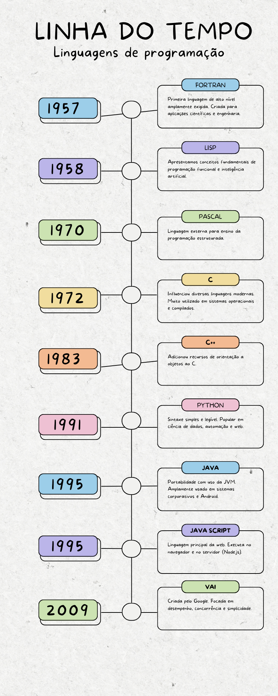

# Desafio 01 - Introdução às Linguagens de Programação

## Objetivo

Apresentar a evolução histórica das linguagens de programação por meio de uma linha do tempo ilustrativa e uma explicação textual dos marcos mais importantes.

## Linha do Tempo

> *Imagem criada com Canva contendo marcos históricos das linguagens.*

## Principais Marcos Históricos

### 1957 - Fortran
Primeira linguagem de alto nível amplamente adotada. Criada para aplicações científicas e engenharia.

### 1958 - Lisp
Introduziu conceitos fundamentais da programação funcional e inteligência artificial.

### 1970 - Pascal
Linguagem voltada para ensino da programação estruturada.

### 1972 - C
Influenciou diversas linguagens modernas. Muito utilizada em sistemas operacionais e compiladores.

### 1980 - Smalltalk
Popularizou a Programação Orientada a Objetos.

### 1983 - C++
Adicionou recursos de orientação a objetos ao C.

### 1991 - Python
Sintaxe simples e legível. Popular em ciência de dados, automação e web.

### 1995 - Java
Portabilidade com uso da JVM. Amplamente usada em sistemas corporativos e Android.

### 1995 - JavaScript
Principal linguagem da web. Executa no navegador e no servidor (Node.js).

### 2009 - Go
Criada pelo Google. Focada em desempenho, concorrência e simplicidade.

### 2010 - Rust
Desempenho comparável ao C++, com foco em segurança de memória sem garbage collector.

### 2011 - Kotlin
Interoperável com Java. Tornou-se a linguagem oficial para desenvolvimento Android.

---

## Considerações Finais

A evolução das linguagens reflete a busca por resolver problemas específicos de forma mais eficiente, segura e expressiva. Cada linguagem trouxe inovações que influenciaram outras, contribuindo para o ecossistema diverso que temos hoje.

---
