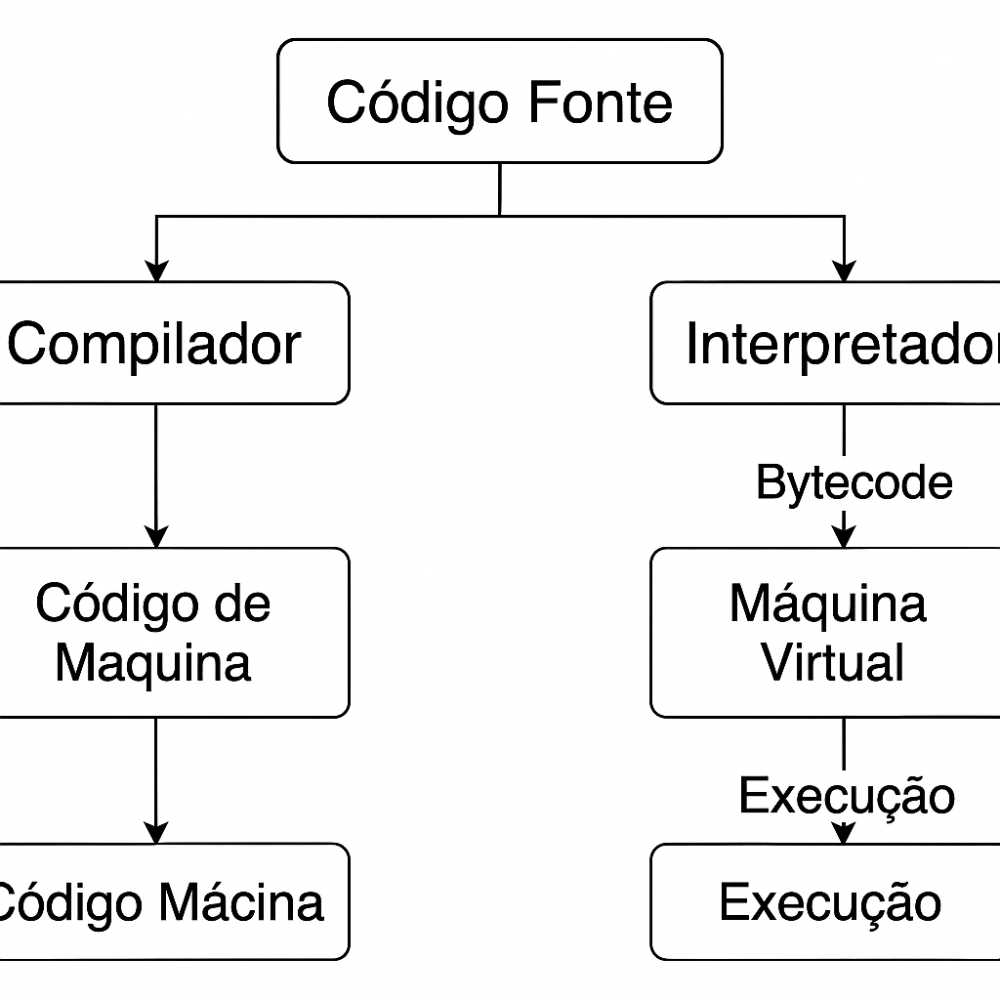

# Desafio 02 - Ambientes de Programação

## Objetivo

Representar e explicar graficamente os diferentes componentes de um ambiente de programação, incluindo:

- Compiladores
- Interpretadores
- Máquinas Virtuais

## Diagrama



> *Imagem ilustrativa criada com Canva, representando o fluxo de tradução e execução de programas.*

## Conceitos

### 🛠️ Compilador

Um **compilador** é um programa que traduz o código-fonte escrito em uma linguagem de alto nível (como C) para código de máquina (linguagem de baixo nível), que pode ser executado diretamente pelo sistema operacional.

- **Exemplo:** Linguagem C → código executável `.exe`
- **Características:** Tradução antecipada, desempenho alto, independente de máquina virtual.

### 🗣️ Interpretador

Um **interpretador** executa o código linha por linha, traduzindo e executando cada instrução dinamicamente, sem gerar um executável intermediário.

- **Exemplo:** Python, JavaScript
- **Características:** Mais flexível para testes, porém mais lento na execução.

### ☕ Máquina Virtual

A **máquina virtual** (como a JVM) executa um código intermediário, chamado de bytecode, que é gerado por um compilador específico. Ela simula um computador virtual.

- **Exemplo:** Java → Compilado em bytecode → Executado na JVM
- **Características:** Portabilidade, segurança, gestão automática de memória.

## Comparativo
```
| Critério         | Compilador             | Interpretador         | Máquina Virtual       |
|------------------|------------------------|------------------------|------------------------|
| Velocidade       | Alta                   | Média/baixa            | Média                 |
| Portabilidade    | Baixa (depende da CPU) | Alta                   | Alta                  |
| Etapas           | Geração de binário     | Execução direta        | Bytecode + execução   |
| Exemplo          | C                      | Python, JavaScript     | Java (JVM), Kotlin    |
```
---

## Considerações Finais

Cada ambiente tem suas vantagens. Compiladores são ideais para performance, interpretadores para flexibilidade e aprendizado, e máquinas virtuais para portabilidade entre sistemas diferentes.
