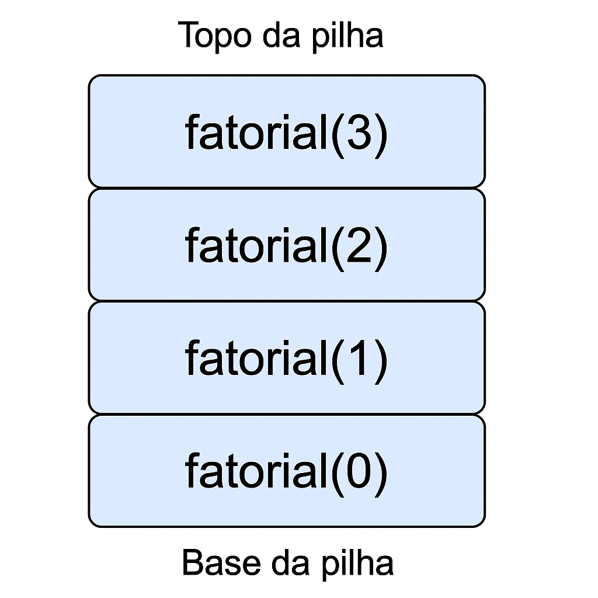

# Desafio 07 – Implementação de Subprogramas

Neste desafio, será apresentada uma função recursiva simples com explicação da **pilha de chamadas** envolvida em sua execução. A linguagem utilizada foi **Python**.

---

## 🧮 Exemplo: Fatorial Recursivo

### Código:

```python
def fatorial(n):
    if n == 0:
        return 1
    else:
        return n * fatorial(n - 1)

resultado = fatorial(3)
print("Resultado:", resultado)
```

### 🔁 Como funciona a pilha de chamadas?
Ao executar `fatorial(3)`, a pilha de chamadas é montada da seguinte forma:
```
fatorial(3)
 └── fatorial(2)
       └── fatorial(1)
             └── fatorial(0) → retorna 1
             → retorna 1 * 1 = 1
       → retorna 2 * 1 = 2
 → retorna 3 * 2 = 6
```
Cada chamada fica em espera até que a recursão atinja o caso base `(n == 0)`. Só então a pilha começa a desempilhar, resolvendo as multiplicações.

### 🧠 Explicação:
A cada chamada de função:
- O estado atual `(n)` é guardado na pilha de execução
- A função só retorna quando a recursão terminar
- Isso gera uma estrutura em forma de pilha (LIFO)

🖼️ Ilustração (Exemplo visual)


